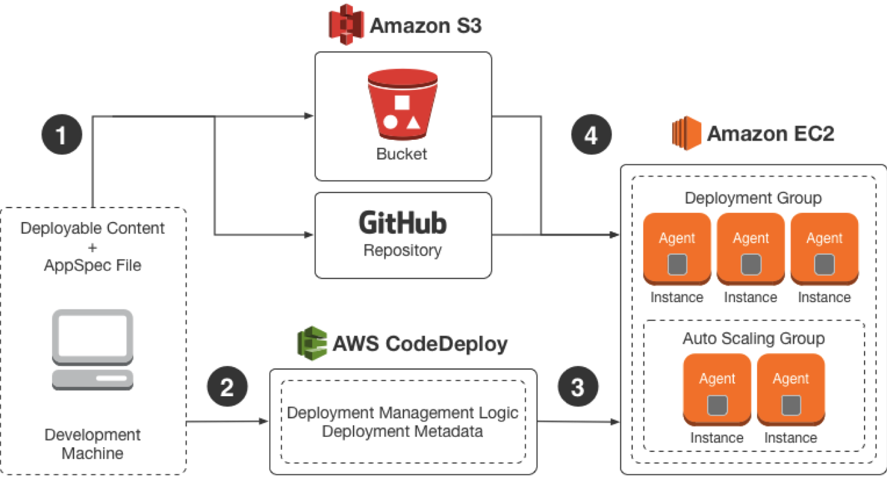
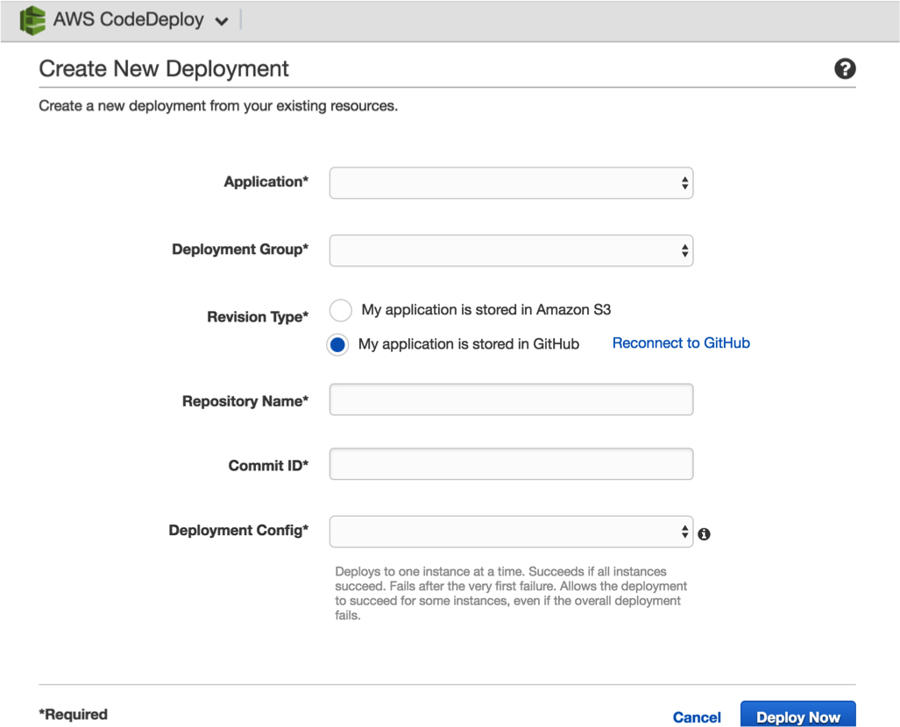

API-Monitor
=======================

## Prerequisites

* Have a RingCentral Admin Account
* Be registered as a [RingCentral Developer](https://developers.ringcentral.com/)
* [Created your sandbox(aka: test or development) account](https://developer.ringcentral.com/library/tutorials/test-account.html) within the RingCentral Developer Portal

## Installation

### Instructions to setup AWS EC2 and Code Deploy

### EC2 Instance Details 
1. EC2 Instance : 
    * RC-API-Health-Monitor  ( Public IP Assigned )
2. IAM Role :
    * codeDeployInstanceRole

### Setup AWS Code Deploy
1. Create a deployment group
    * APIMonitor Deployment Group
2. Newer Revisions get Automatically Deployed to AWS EC2:
    * [AWS Code Deploy Using Git Repository](https://www.youtube.com/watch?v=suI-bUByP_k)

### AWS Code Deploy - Revision

### AWS Cloud Watch
1. Monitor incoming log entries
    * [Info]
    * [Error]
    * [Success]    
2. Setup Metrics on Cloudwatch to listen to entries
3. Trigger an Alarm or Integrate to Amazon SNS Topics to dispatch email ( DRE )

## SDK 

Current used RCSDK version for this demo is :
[RCSDK-1.0.0](https://github.com/ringcentral/ringcentral-python)
* Make sure to change the SDK version in the package.json before you chose to use a different SDK Version.

## Links

Project Repo

* https://github.com/anilkumarbp/APIMonitor

RingCentral API Docs

* https://developers.ringcentral.com/library.html

RingCentral API Explorer

* http://ringcentral.github.io/api-explorer

## Contributions

Any reports of problems, comments or suggestions are most welcome.

Please report these on [API-Monitor's Issue Tracker in Github](https://github.com/vyshakhbabji/APIMonitor/issues).

## License

RingCentral SDK is available under an MIT-style license. See [LICENSE.txt](LICENSE.txt) for details.

RingCentral SDK &copy; 2016 by RingCentral

## FAQ

* What if I do not have a RingCentral account? Don't have an account, no worries: [Become a RingCentral Customer](https://www.ringcentral.com/office/plansandpricing.html)
* I/My company is an Independent Software Vendor (ISV) who would like to integrate with RingCentral, how do I do that? You can apply to [Join the RingCentral Partner Program](http://www.ringcentral.com/partner/isvreseller.html)
